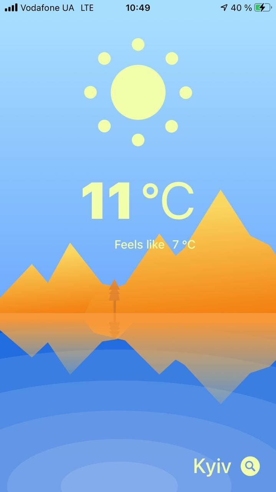
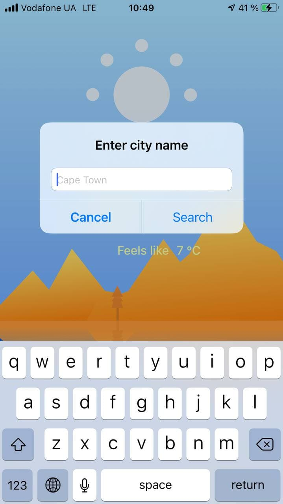

# WeatherApp
Weather application using OpenWeatherMapAPI

You can easily find current weather in different cities around the world or your current location weather.
Using Swift, CoreLocation, OpenWeatherMapAPI

